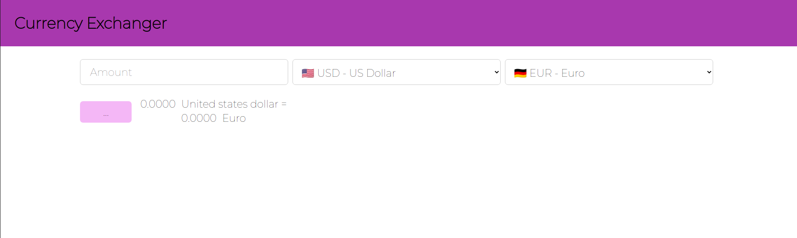

## Currency convertor

<p align="center">
  
</p>

## About The Project

This application feature designed for Genesis, helps the users to convert, at current rate, between different currencies.

<br />

## Live Version

* [Live Demo](https://currency-exchanger-genesis.netlify.app/) 

<br />

## Table of Contents

<br />

* [About the Project](#about-the-project)
* [Built With](#built-with)
* [How to play](#how-to-play) 
* [Contributing](#contributing)
* [Contact](#authors)
* [Acknowledgements](#acknowledgements) 
* [Getting Started](#getting-started) 
* [Live Demo](#live-version) 

<br />

 <br/>
 <br/>
 <br/>
 <br/>
 <br/>


## Screenshot

<p align="center">
  
</p>

### Built With

* [TYPESCRIPT] [REACT] [XEAPI] [NETLIFY] [PWA] [SASS]

<br />


## Contributing

Contributions make the open-source community such an amazing place to learn, inspire, and create. Any contributions you make are **greatly appreciated**.

## Prerequisites

Terminal or similar to execute the program.


## Getting Started


## Clone project
- To get a local copy up and running follow these simple example steps.
- Clone this repository with git clone ```https://github.com/sergiocortessat/genesis-test/tree/feature``` using your terminal or command line.
- Change to the project directory by entering: ```cd genesis-test``` in the terminal.
- Enter the command npm i
- Enter the project folder and run locally by using npm start.

## Command line steps
```
- $ git clone `$ git clone https://github.com/sergiocortessat/genesis-test/tree/feature
- $ git checkout develop
- $ cd genesis-test
- $ npm i
- $ npm start
```


## Authors

👤 Sergio Cortes Satizabal

- Github: [@sergiocortessat](https://github.com/sergiocortessat)
- Twitter: [@sergiocortessat](https://twitter.com/sergiocortessat)
- LinkedIn: [@sergiocortessat](https://linkedin.com/in/sergiocortessat)


<!-- ACKNOWLEDGEMENTS -->
## Acknowledgements

* [Genesis Design]


## 📝 License

This project is [MIT](https://github.com/sergiocortessat/sergiocortessat/blob/main/LICENSE) licensed.
